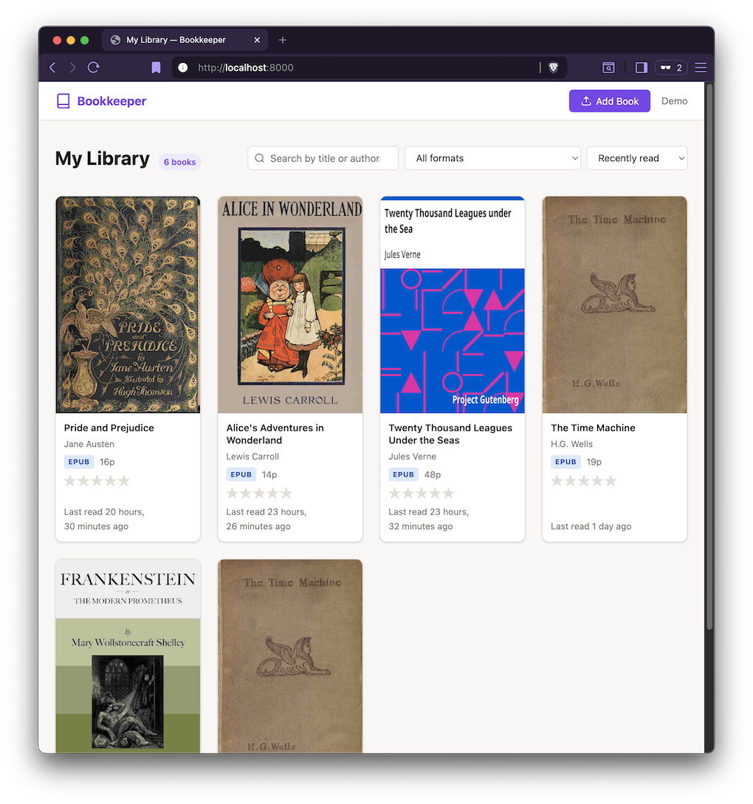

# django-bookkeeper

[](https://pypi.org/project/django-bookkeeper/)
[](https://pypi.org/project/django-bookkeeper/)
[](https://www.djangoproject.com/)
[](https://github.com/ehwio/django-bookkeeper/actions/workflows/ci.yml)
[](LICENSE)
[](https://github.com/astral-sh/ruff)

A Django app for storing, cataloguing, and reading e-Books (PDF, EPUB, CBZ).
[](docs/screenshots/screenshot-library-large.png)
## Features

- **Upload** PDF, EPUB, and CBZ files (drag-and-drop or browse)
- **Automatic metadata extraction** — title, author, publisher, cover image
- **Deduplication** by SHA-256 hash
- **Modern reader** with:
  - EPUB rendering via [epub.js](https://github.com/futurepress/epub.js/)
    (chapters are extracted to HTML at upload time for performance;
    epub.js is used as a fallback for fixed-layout EPUBs)
  - PDF rendering via [PDF.js](https://mozilla.github.io/pdf.js/)
  - CBZ page-by-page comic reader
  - Keyboard navigation (arrow keys)
- **Reader settings**: light/sepia/dark themes, font family & size, line height, column width
- **Highlights** in five colours with optional notes
- **Bookmarks** with titles and notes
- **Reading progress** — auto-saved position and percentage
- **5-star ratings** per user
- **Favourites** and finished-book tracking
- **Extensible hook signals** for recent-books lists, activity feeds, etc.
- Django best-practices: `django-storages` compatible, `AUTH_USER_MODEL` aware, namespaced URLs

## Try the demo

The fastest way to see Bookkeeper in action — one command downloads five
public-domain classics from Project Gutenberg and starts a local server:

```bash
git clone https://github.com/ehwio/django-bookkeeper
cd django-bookkeeper
make demo
```

Then open **http://127.0.0.1:8000/** and sign in as `demo` / `demo`.

> On subsequent runs, use `make demo-run` to start the server without re-seeding.
> Use `make demo-reset` to wipe the database and media and re-seed from scratch.

**Admin interface:** after seeding, create an admin account to access `/admin/`:

```bash
cd demo
PYTHONPATH=../src:.. uv run python manage.py create_admin
```

Then visit **http://127.0.0.1:8000/admin/** and sign in with your admin credentials.

**Or with Docker:**

```bash
docker compose up
```

> Uses `Dockerfile.demo` — builds the demo image from the `demo/` directory.

The demo ships with:
- *Pride and Prejudice* — Jane Austen
- *Twenty Thousand Leagues Under the Seas* — Jules Verne
- *The Time Machine* — H.G. Wells
- *Alice's Adventures in Wonderland* — Lewis Carroll
- *Frankenstein* — Mary Wollstonecraft Shelley

> Books are downloaded from [Project Gutenberg](https://www.gutenberg.org/) on first run.
> They are public domain and freely distributable.

---

## Installation

```bash
pip install django-bookkeeper
# or
uv add django-bookkeeper
```

Add to `INSTALLED_APPS`:

```python
INSTALLED_APPS = [
    ...
    "bookkeeper",
]
```

Include URLs:

```python
# urls.py
from django.urls import include, path

urlpatterns = [
    path("books/", include("bookkeeper.urls", namespace="bookkeeper")),
]
```

Run migrations:

```bash
python manage.py migrate
```

## Dependencies

`django-bookkeeper` requires Django 4.2 or later and uses these packages:

| Package | Purpose |
|---------|---------|
| `django-storages` | Storage backend abstraction |
| `Pillow` | Image processing (covers) |
| `ebooklib` | EPUB metadata/structure extraction |
| `PyMuPDF` | PDF text/metadata extraction |
| `python-magic` | File type detection |
| `beautifulsoup4` | HTML/XML parsing |
| `lxml` | Fast XML/HTML processing |
| `rarfile` | CBR comic support |

## Optional dependencies

| Feature | Package / Requirement |
|---------|---------|
| Social login | `social-auth-app-django` |
| CBR comic support | system `unrar` or `unar` binary |
| Cloud storage | Already included — `django-storages` is a required dependency |

## Hooks

Connect to Bookkeeper signals to extend behaviour:

```python
from bookkeeper.hooks import book_opened, book_finished, progress_updated

@book_opened.connect
def track_recent(sender, user, book, **kwargs):
    RecentBook.objects.update_or_create(user=user, defaults={"book": book})
```

Available signals: `book_opened`, `progress_updated`, `book_finished`, `book_rated`,
`book_uploaded`, `highlight_created`, `bookmark_created`.

## Development

```bash
git clone https://github.com/ehwio/django-bookkeeper
cd django-bookkeeper
uv sync --extra dev
uv run pytest --cov
uv run ruff check src/ tests/ demo/
```

### GitFlow

- `main` — stable releases
- `develop` — integration branch
- `feature/*` — new features
- `fix/*` — bug fixes
- `release/*` — release prep

See [RELEASING.md](RELEASING.md) for the step-by-step release process
(TestPyPI → PyPI via GitHub Actions).

## License

MIT
